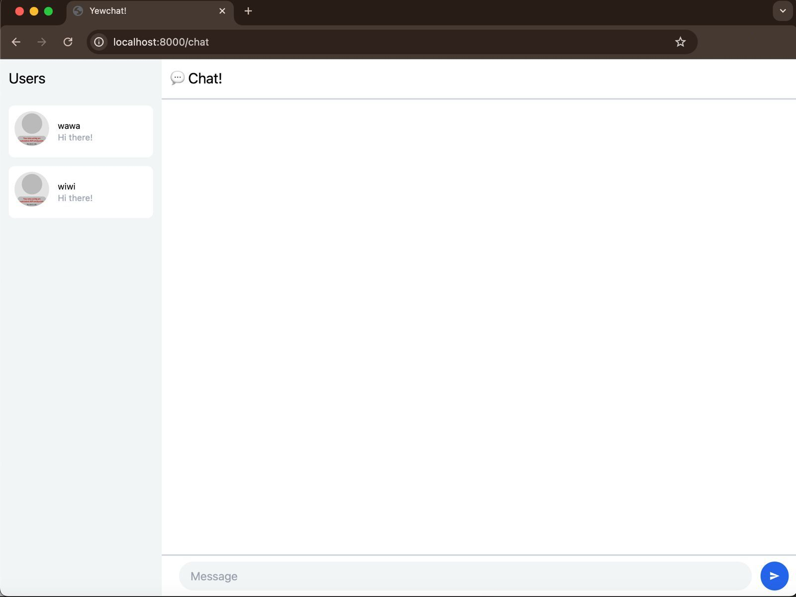
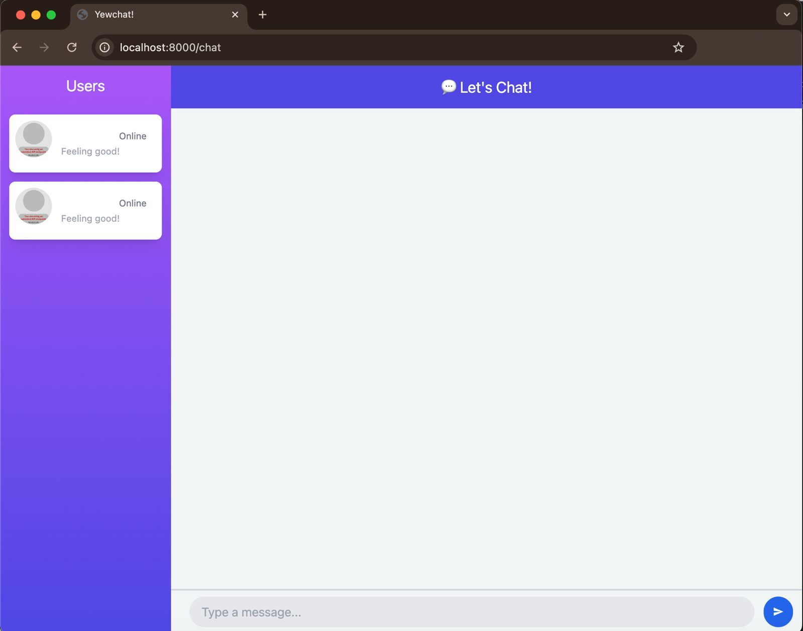

Pemrograman Lanjut (Advanced Programming) 2024/2025 Genap

- Nama : Nashwa Ghania
- NPM : 2306241770
- Kelas : Pemrograman Lanjut - A

### Reflection:
#### 3.1 Original code

#### 3.2 Add some creativities to the webclient

Perubahan yang dilakukan cukup sederhana tapi bikin tampilan jadi lebih hidup. Latar belakang sidebar dan header sekarang pakai gradasi warna, jadi nggak monoton dan lebih enak dilihat. Di samping nama pengguna juga sudah muncul status "Online", walau masih statis, tapi ke depannya bisa dikembangin biar lebih dinamis. Efek bayangan ditambahkan di chat bubble dan daftar pengguna biar kelihatan seperti melayang, kesannya modern. Terakhir, ditambahkan placeholder kalimat "Feeling good!" di sidebar, jadi suasananya lebih santai dan ramah. Singkatnya, tampilan jadi lebih segar dan siap dikembangkan lebih jauh.